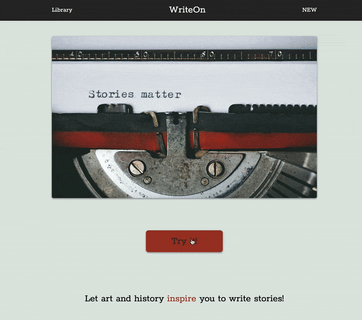

# WriteOn
  An app for writers that want to write stories inspired by famous art and history.

## Technologies Used
  * JavaScipt
  * HTML5
  * CSS3
  * [Accessing The Metropolitan Museum of Art Collection API](https://metmuseum.github.io) with XMLHttpRequest.
## Try it
[WriteOn](https://stevebehm.github.io/WriteOn/)
## Features
  * User can view a random work of art
  * User can create a story based on the work of art
  * User can view a library of previously saved stories
  * User can edit a previously saved story
  * User can delete a saved story
## Strecth Features
  * User can search for different types of art
## Preview
  
## Getting Started
1. Clone the repository.

```shell
git clone https//github.com/SteveBehm/WriteOn.git
cd WriteOn
```

2. Install all dependencies with NPM.

```shell
npm install
```

3. Begin coding, making sure to open index.html in your default browser to check your work.
